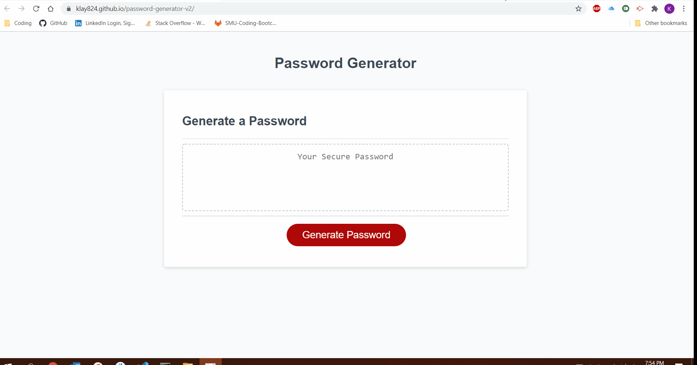
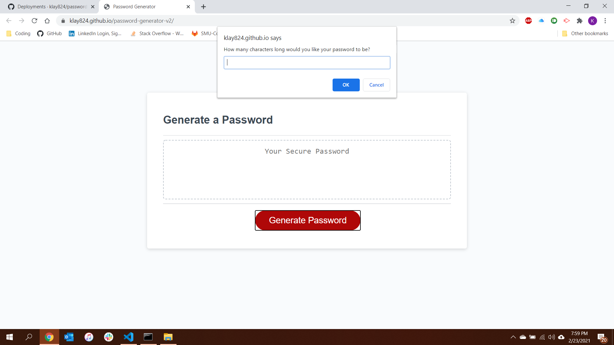
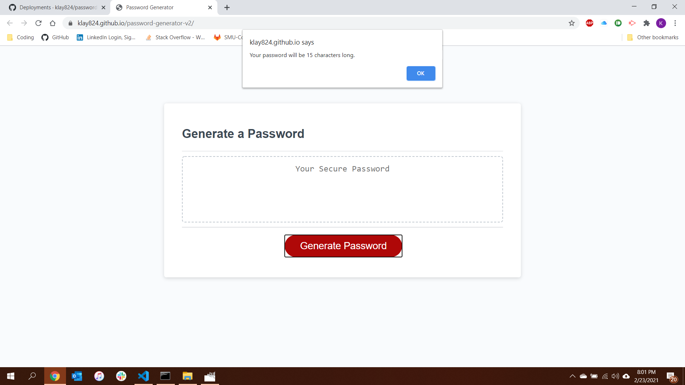
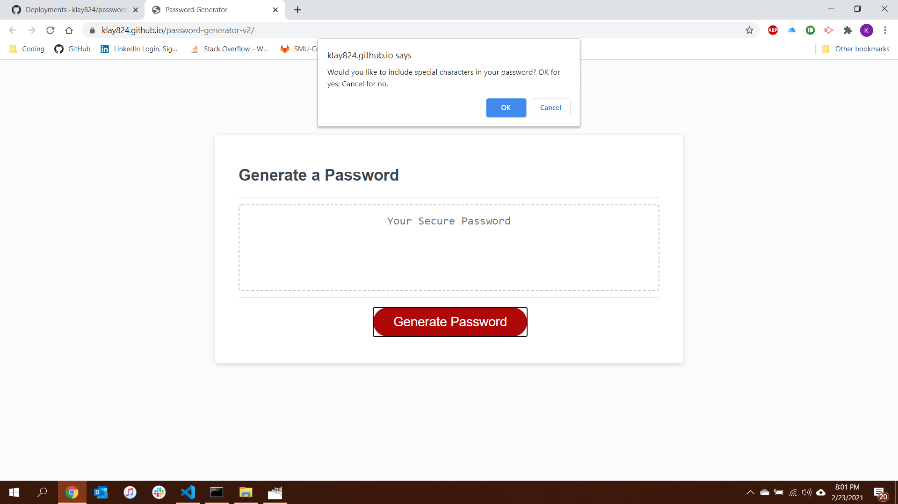
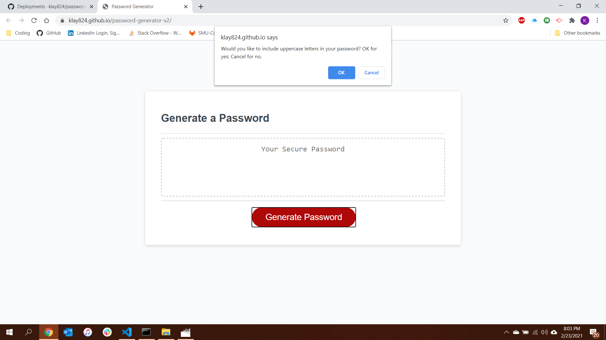
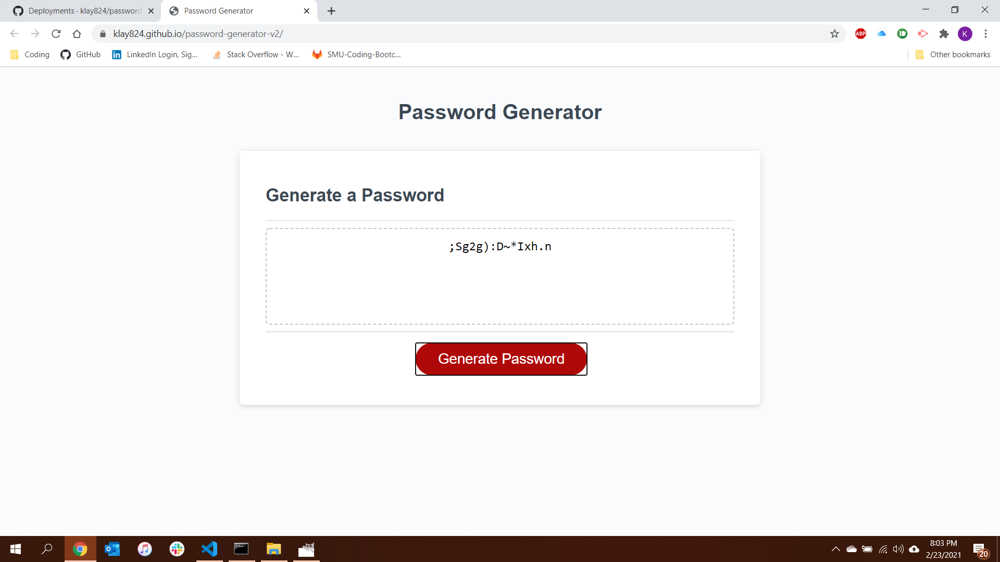

# Password Generator

I have created a password generator using JavaScript. The homework assignment provided the HTML, the CSS, and a small portion of JavaScript for this activity. Upon clicking "Generate Password" the user will be prompted to enter in how many characters they would like their password to be. The user must enter their desired password length as a number or they will receive an alert. If they select a number less than 8 or higher than 128, they will receive an alert that their password must between 8 and 128 characters long. They will then receive the character prompt again.  After the user inputs the number of characters they would like their password to be, the program will provide an alert letting them know how long their password will be.

Upon chosing a number between the parameters, the user will be asked if they want to include uppercase letters, lowercase letters, special characters, or numbers in their password. After each prompt the user should chose OK or Cancel. If the user selects Cancel for each question, they will receive an alert that they must make at least one password parameter choice.

After the user has chosen at least one parameter, the program will generate a password using the random parameters the user chose and output it to the HTML.

Please follow [this link](https://klay824.github.io/password-generator-v2/) to view the live application.

## GIF Demonstration of Application

## Screenshots

